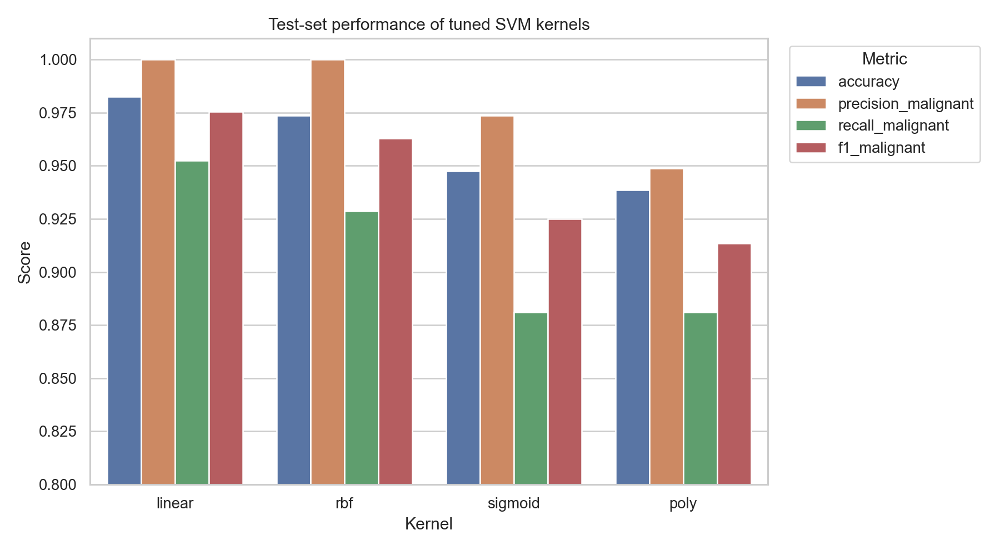
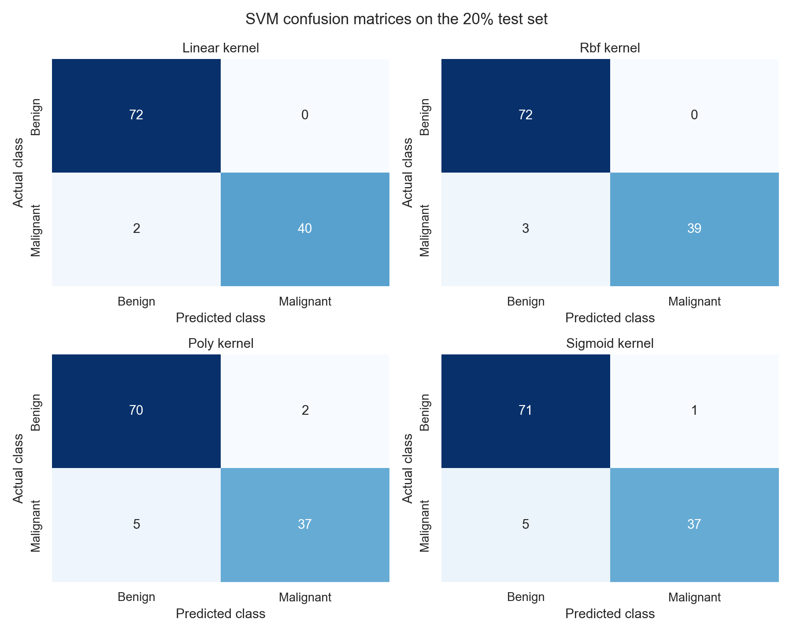
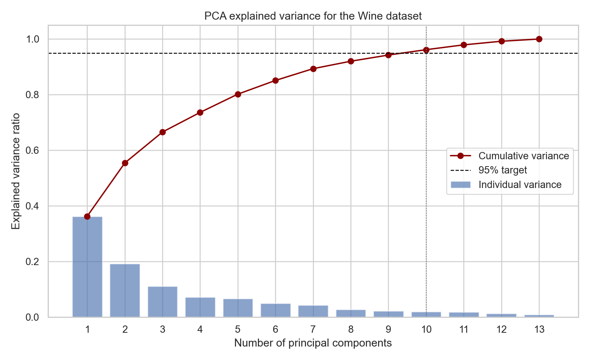
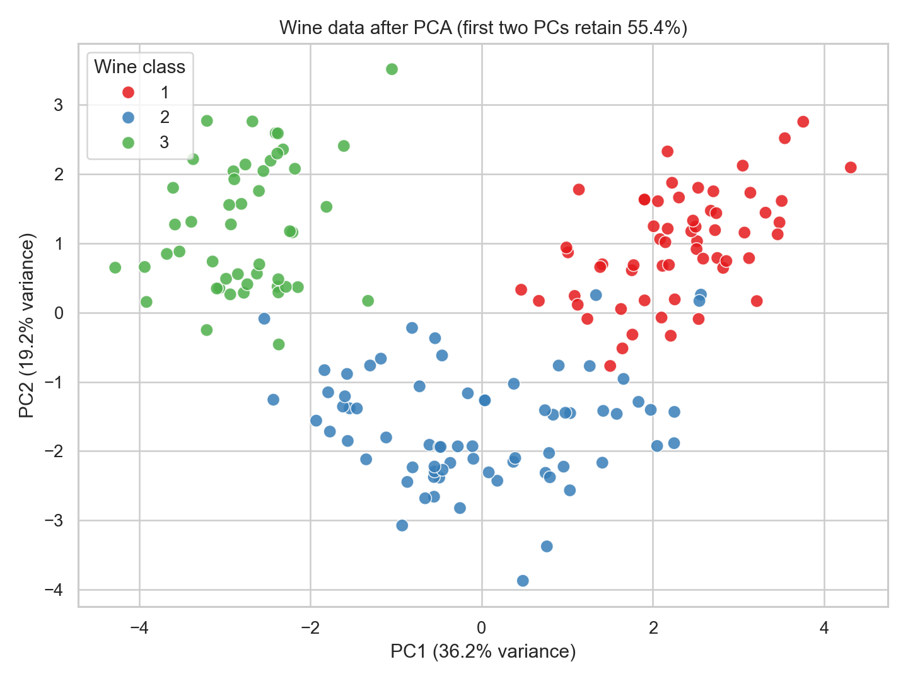
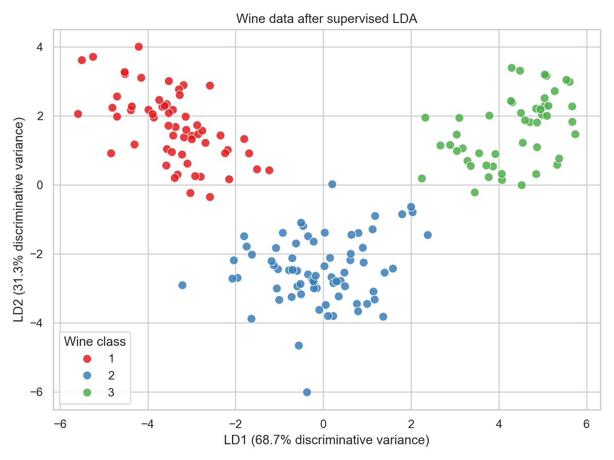

# Lab 9: Support Vector Machine and Principal Component Analysis

## Aim

To implement Support Vector Machine (SVM) for classification and Principal
Component Analysis (PCA) for dimensionality reduction, and to analyse their
effectiveness using real-world datasets.

## Software and data

- Python 3 with NumPy, pandas, scikit-learn, Matplotlib, and seaborn
- `wdbc.data`: UCI Wisconsin Diagnostic Breast Cancer dataset
- `wine.data`: UCI Wine dataset
- Reproducible implementation: `lab09_svm_pca.py`
- Random seed: 42

The supplied `.names` files were used to assign meaningful column names. The
identifier in WDBC was removed because it is not a predictive measurement. Both
datasets contain no missing values.

## Part A: Support Vector Machine

### Method

The WDBC data contains 569 observations, 30 real-valued predictors, and a
binary diagnosis: benign (B) or malignant (M). The data was divided with a
stratified 80:20 split, giving 455 training observations and 114 test
observations. The same untouched test set was used for every kernel.

Each model used a pipeline containing `StandardScaler` followed by `SVC`.
Scaling is essential because an SVM is based on distances and margins and the
WDBC features have very different units. Hyperparameters were selected only on
the training set using shuffled, stratified 5-fold cross-validation, with macro
F1 as the selection score. The following were explored:

- Linear: `C`
- RBF: `C` and `gamma`
- Polynomial: `C`, `gamma`, and `degree`
- Sigmoid: `C` and `gamma`

Precision, recall, and F1 below treat malignant diagnosis as the positive class.
This is useful clinically because false-benign predictions are missed malignant
cases.

### Hyperparameter-tuning results

| Kernel | Best parameters | Mean validation macro F1 |
|---|---|---:|
| Linear | C = 0.1 | 0.9644 |
| RBF | C = 10, gamma = scale | 0.9741 |
| Sigmoid | C = 1, gamma = scale | 0.9621 |
| Polynomial | C = 10, gamma = 0.1, degree = 3 | 0.9520 |

RBF achieved the highest cross-validation score, while linear achieved the best
result on this particular test partition. This small difference shows why model
selection should be based on cross-validation rather than repeatedly consulting
the final test set.

### Test-set performance

| Kernel | Accuracy | Precision (M) | Recall (M) | F1 (M) | TN | FP | FN | TP |
|---|---:|---:|---:|---:|---:|---:|---:|---:|
| Linear | 0.9825 | 1.0000 | 0.9524 | 0.9756 | 72 | 0 | 2 | 40 |
| RBF | 0.9737 | 1.0000 | 0.9286 | 0.9630 | 72 | 0 | 3 | 39 |
| Sigmoid | 0.9474 | 0.9737 | 0.8810 | 0.9250 | 71 | 1 | 5 | 37 |
| Polynomial | 0.9386 | 0.9487 | 0.8810 | 0.9136 | 70 | 2 | 5 | 37 |

Here TN means correctly predicted benign, FP means benign predicted malignant,
FN means malignant predicted benign, and TP means correctly predicted
malignant.





### SVM observations

- The tuned linear model performed best on the test set, classifying 112 of 114
  observations correctly.
- Its malignant precision was 100%, so every malignant prediction was correct.
  Its 95.24% recall means it missed two of the 42 malignant cases.
- Linear and RBF kernels both performed very well. This agrees with the dataset
  description, which says the 30-dimensional classes are linearly separable.
- Polynomial and sigmoid kernels produced more false-benign predictions and did
  not improve over the simpler linear decision boundary.
- In a medical deployment, recall/sensitivity and external validation would be
  especially important. A decision threshold or class weighting could be tuned
  if the cost of a missed malignant case is considered greater than that of a
  false alarm.

## Part B: Principal Component Analysis

### Method

The Wine data contains 178 observations from three cultivars and 13 continuous
chemical features. All features were standardized to zero mean and unit
variance before PCA. PCA was first fitted with all 13 components so that its
complete explained-variance profile could be analysed. The first two component
scores were then retained for visualization.

### Explained variance

| Component | Individual variance | Cumulative variance |
|---:|---:|---:|
| PC1 | 36.20% | 36.20% |
| PC2 | 19.21% | 55.41% |

The first two PCs retain **55.41%** of the standardized dataset's total
variance. The minimum number required to retain at least 95% is **10 PCs**;
together they retain **96.17%**.





### Original versus transformed data

| Representation | Features | Information retained | Expected computational effect |
|---|---:|---:|---|
| Standardized original | 13 | 100% | Baseline storage and processing |
| PCA visualization | 2 | 55.41% | 84.62% fewer features; fastest but substantial variance is discarded |
| PCA at 95% target | 10 | 96.17% | 23.08% fewer features with limited variance loss |

PCA adds a one-time cost to standardize the data and compute the decomposition.
Subsequent algorithms can be faster because they receive fewer, mutually
orthogonal input variables. Whether 2 or 10 PCs is appropriate depends on the
task: two are excellent for visualization, whereas ten satisfy the stated 95%
information criterion.

### Significance of the first two components

The features with the five largest absolute loadings were:

- PC1: flavanoids, total phenols, OD280/OD315, proanthocyanins, and
  nonflavanoid phenols
- PC2: color intensity, alcohol, proline, ash, and magnesium

Thus, PC1 is mainly a contrast involving phenolic composition, while PC2 is
influenced more by color intensity, alcohol, mineral content, and proline. These
two independent directions reveal visible cultivar grouping without using the
class labels. Loading signs can reverse without changing the PCA solution, so
their magnitudes and relative patterns are more important than an isolated sign.

### Advantages, limitations, and applications of PCA

Advantages:

- Reduces storage and training time and can mitigate the curse of
  dimensionality.
- Removes linear correlation and multicollinearity between transformed
  features.
- Supports two- or three-dimensional visualization of high-dimensional data.
- Can suppress low-variance noise when a suitable number of components is kept.

Limitations:

- PCA is linear and may not describe nonlinear structure.
- Components are combinations of many original features and are less directly
  interpretable.
- High variance is not always the same as high predictive usefulness because
  PCA ignores target labels.
- Results are sensitive to feature scale, outliers, and the selected component
  count.

Applications include image compression, exploratory visualization, sensor and
spectral-data compression, preprocessing before clustering or classification,
noise reduction, and removal of multicollinearity.

## Extra credit: Linear Discriminant Analysis

LDA was applied to the same standardized Wine data. With three classes, LDA can
produce at most `classes - 1 = 2` discriminant axes. Unlike PCA, it uses class
labels and explicitly maximizes separation between classes relative to variation
within each class.



| Two-dimensional representation | Silhouette score | Between/within-class scatter ratio |
|---|---:|---:|
| PCA | 0.5262 | 3.4055 |
| LDA | 0.6632 | 6.6051 |

Higher values indicate better grouping under these descriptive measures. LDA
shows clearer class separation because it is supervised and optimizes for that
purpose. PCA remains useful when labels are unavailable or when the objective is
to preserve overall variance rather than discriminate known classes.

## Overall conclusion

SVM demonstrates supervised learning by learning a decision boundary from
labelled cancer diagnoses. After scaling and tuning, linear and RBF SVMs both
generalized strongly, with the linear kernel reaching 98.25% test accuracy. PCA
demonstrates unsupervised learning: it compressed 13 Wine features into
orthogonal directions without using cultivar labels. Two PCs provided a useful
plot but retained only 55.41% of variance, while ten PCs were required for the
95% target. Extra-credit LDA used labels to create a two-dimensional space with
greater measured class separation than PCA.

## Reproduction

Install the dependencies and execute:

```powershell
python -m pip install -r requirements.txt
python .\lab09_svm_pca.py
```

Machine-readable tables, transformed coordinates, figures, and a JSON summary
are written to `outputs/`.
